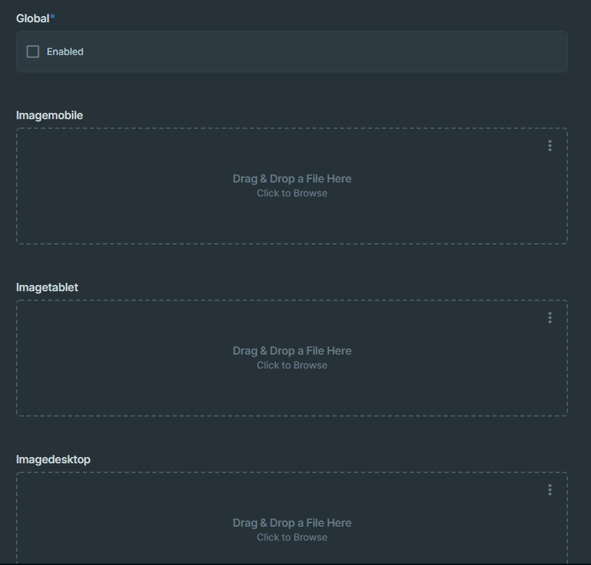

# Directus Conditional Fields

Simple Directus Extension that allows conditionally showing or hiding fields.

> Status: This project is archived. You shouldn't need this anymore, as directus v9 now includes this feature!

## Example



Configuration used for the example:

```json
[
    {
        "toggle": "global",
        "conditions": [
            {
                "value": true,
                "show": [
                    "imageglobal"
                ],
                "hide": [
                    "imagemobile",
                    "imagetablet",
                    "imagedesktop"
                ]
            },
            {
                "value": false,
                "hide": [
                    "imageglobal"
                ],
                "show": [
                    "imagemobile",
                    "imagetablet",
                    "imagedesktop"
                ]
            }
        ]
    }
]
```

## Usage

1. Build it via `npm run build`
1. Copy `dist/index.js` to `/directus/extensions/interfaces/conditional-fields/` (or whereever your extension folder is)
1. Add a new json field to your collection and select the `Conditional Fields` interface
1. Enter your conditions in the json input field
1. Optionally enable debug mode to see why your conditions don't work as expected, it will print stuff to your browser console


## Configuration

The Conditions field expects an array of objects.
Each of these objects expect a `toggle`, which is the name of the field which should toggle other fields, and an array of conditions.  
These conditions have a value. If the value of the `toggle` is equal to the value of the condition, the condition will be executed.  
The also have `hide` and `show` arrays, these contain field names of the fields that should be shown or hidden.

## Note

This repo is a mirror of some internal repo at work. It might not always be up to date. If something is wrong, open an issue and ill make sure this repo is up to date with what I use...

Hopefully directus will have extensions via npm sometime, then I can make this the leading repo and use the npm packet at work too :)
